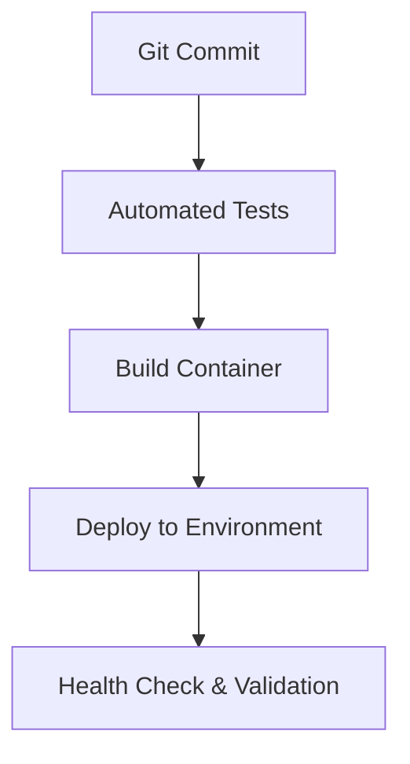

<!-- ===================================================== -->
<!-- MLOps Pipeline System — README.md -->
<!-- Premium • Interactive • Brand-Consistent -->
<!-- ===================================================== -->

<div align="center">


<br/>


<br/><br/>

<a href="#-lifecycle-architecture"><b>Lifecycle</b></a> •
<a href="#-pipeline-structure"><b>Pipeline</b></a> •
<a href="#-automation-logic"><b>Automation</b></a> •
<a href="#-production-boundaries"><b>Production</b></a> •
<a href="#-recruiter-snapshot"><b>Recruiter Snapshot</b></a> •
<a href="#-contact"><b>Contact</b></a>

</div>

---

# 🔁 Lifecycle Architecture

<details open>
<summary><b>🧬 From Training → Production (click to collapse)</b></summary>

<br/>


</details>

This is not just training a model.  
This is designing the system around the model.

---

# 🏗 Pipeline Structure

<details open>
<summary><b>⚙️ Engineering-Oriented Breakdown (click to collapse)</b></summary>

<br/>

```
/data
   ├── ingestion
   ├── validation
/model
   ├── training
   ├── evaluation
/service
   ├── api
   ├── inference
/deployment
   ├── dockerfile
   ├── configs
/monitoring
   ├── logging
   ├── metrics
```

Each directory reflects lifecycle separation.

Training logic is not mixed with serving logic.  
Inference code is not mixed with experimentation.

That separation is production maturity.

</details>

---

# ⚙️ Automation Logic

<details open>
<summary><b>🔁 CI/CD Flow for ML Systems (click to collapse)</b></summary>

<br/>



</details>

Automation ensures:

- Reproducible builds  
- Version-controlled models  
- Consistent deployments  
- Reduced manual intervention  

ML without automation is experimentation.  
ML with automation is engineering.

---

# 🧱 Production Boundaries

Instead of another diagram, here is the system segmentation view:

```
┌────────────────────────────┐
│  Experimentation Layer     │
│  • Model training          │
│  • Hyperparameter tuning   │
└────────────┬───────────────┘
             │
┌────────────▼───────────────┐
│  Packaging Layer           │
│  • Model serialization     │
│  • Versioning              │
└────────────┬───────────────┘
             │
┌────────────▼───────────────┐
│  Serving Layer             │
│  • REST API                │
│  • Inference endpoint      │
└────────────┬───────────────┘
             │
┌────────────▼───────────────┐
│  Observability Layer       │
│  • Logging                 │
│  • Performance metrics     │
└────────────────────────────┘
```

This prevents:

- Hidden training-serving skew  
- Unversioned models  
- Deployment drift  

---

# 🌟 System Impact

This project demonstrates:

- End-to-end ML lifecycle ownership  
- Production-ready system design  
- Model versioning discipline  
- CI/CD integration for ML  
- Containerized deployment thinking  
- Observability awareness  

This moves from:

```
Train Model → Save Model
```

to

```
Design System → Automate → Deploy → Monitor → Improve
```

---

# 🎯 Recruiter Snapshot

<details open>
<summary><b>📌 What This Proves in One Glance (click to collapse)</b></summary>

<br/>

<div align="center">

<table>
<tr>
<td width="50%" valign="top">

### Engineering Capability
- Structured pipeline design  
- Automation mindset  
- Environment reproducibility  
- Clean separation of layers  

</td>
<td width="50%" valign="top">

### ML Maturity
- Lifecycle awareness  
- Production readiness  
- Deployment responsibility  
- Monitoring integration  

</td>
</tr>
</table>

</div>

</details>

---

# 📬 Contact

<div align="center">

<a href="https://www.linkedin.com/in/navyashree-byregowda-472821196/">

</a>

<a href="https://github.com/Navyagowda2714">

</a>

<a href="mailto:navyashreebyregowda@gmail.com">

</a>

<br/><br/>
<sub>MLOps Pipeline System — engineering discipline for production-grade machine learning.</sub>

</div>
